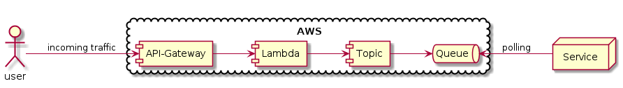
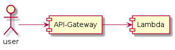
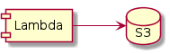

Amazon AWS example templates
============================

This is a collection of Amazon AWS example templates.
Use CloudFormation to build the infrastructure.

ApiGateway to Lambda to Topic to Queue
--------------------------------------

Incoming traffic can be stored asynchroniosly in the cloud. The target service can poll the request from the queue.

Motivation:

* higher availability
* buffer peak load

ApiGateway to Lambda
--------------------

This example schows how to connect a simple lambda to an api gateway.

Lambda to S3
------------

In this example a lambda simply writes a string into a s3 bucket file.

